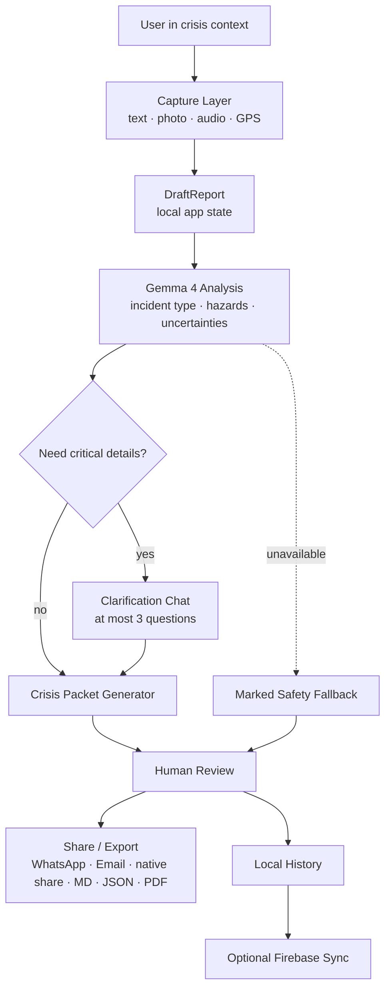

# SignalPack

<p align="center">
  
</p>

<p align="center">
  <strong>Turn chaos into clarity.</strong><br />
  Gemma 4-powered emergency capture, structure, review, and sharing.
</p>

<p align="center">
  <strong>Demo:</strong> <a href="https://pixek.xyz/signalpack">pixek.xyz/signalpack</a><br />
  <a href="#demo-flow">Demo Flow</a> ·
  <a href="#architecture">Architecture</a> ·
  <a href="#gemma-4-ai-layer">Gemma 4 AI Layer</a> ·
  <a href="#share--export">Share & Export</a> ·
  <a href="#running-locally">Run Locally</a> ·
  <a href="#competition-positioning">Competition</a>
</p>

---

## What Is SignalPack?

SignalPack is a local-first PWA for moments when people need to turn messy emergency information into a clear, reviewable packet.

The app captures text, photo, voice notes, and GPS context, then uses **Gemma 4 through OpenRouter** to structure the critical details into a **Crisis Packet**:

- what happened
- who may be at risk
- what hazards are visible
- what is uncertain
- what immediate actions are reasonable
- what message can be shared safely

SignalPack is not a dispatch system and does not replace emergency services. It is a human-controlled reporting layer: users review before sharing, and fallback mode is clearly marked when AI is unavailable.

## Product Frame

```txt
Prepare -> Alert -> Understand -> Act
```

| Stage | SignalPack Surface | Purpose |
| --- | --- | --- |
| Prepare | Emergency Profile, Safety Guide, Settings, PWA install | Keep useful context ready before stress hits. |
| Alert | Start Alert, Rapid Packet, Quick Capture | Capture the signal quickly by text, photo, audio, and GPS. |
| Understand | Gemma 4 Analysis, clarification questions, AI trace | Structure risk, missing details, and uncertainty. |
| Act | Crisis Packet, share text, export, map, history | Review, copy, export, or share a concise packet. |

## Demo Flow

Hosted demo target:

```txt
https://pixek.xyz/signalpack
```

Use this scenario for the competition demo:

```txt
Water entered the ground floor. Two elderly people are inside. Exit may be blocked.
```

Recommended demo path:

1. Open SignalPack.
2. Press **Start Alert**.
3. Add the scenario text, optionally attach a photo or voice note.
4. Send to **Gemma 4**.
5. Review detected hazards and missing critical details.
6. Answer clarification questions if shown.
7. Generate the **Crisis Packet**.
8. Show `model_provider`, `model_name`, `ai_trace`, `fallback_used`, and `safety_sources`.
9. Export or share the packet.

## Architecture



## System Layers

```txt
src/
  App.tsx                    # App state router and screen orchestration
  SettingsContext.tsx         # Runtime settings stored in localStorage
  components/
    Home.tsx                  # Main Crisis Packet dashboard
    NewReport.tsx             # Text/photo/audio/GPS capture
    AIReview.tsx              # Gemma 4 analysis review
    Clarification.tsx         # Follow-up question flow
    PacketOutput.tsx          # Final Crisis Packet, export, share
    SettingsScreen.tsx        # OpenRouter, workflow, map, local data
    MenuOverlay.tsx           # Mobile navigation only
  engine/
    ai/
      providers.ts            # OpenRouter Chat Completions provider
      prompts.ts              # Safety and packet-generation prompts
      fallback.ts             # Deterministic marked fallback
      index.ts                # analyzeIncident, askGemma, generatePacket
    location/                 # GPS helper
    media/                    # Local image compression
    state/                    # Zustand app state
    sync/                     # Offline queue for optional cloud sync
```

## Gemma 4 AI Layer

SignalPack is API-first for the live PWA and focused on Gemma 4.

| Area | Current Implementation |
| --- | --- |
| Hosted provider | OpenRouter Chat Completions API |
| Default model | `google/gemma-4-31b-it:free@preset/signalpack` |
| OpenRouter preset | `@preset/signalpack` |
| API key storage | Browser `localStorage`, entered in Settings; hosted demo can inject a deploy-time key |
| Public repo key | None. Users bring their own OpenRouter key. |
| Local model target | `google/gemma-4-E2B` from Hugging Face |
| Fallback | Deterministic safety fallback, explicitly marked |
| Traceability | Crisis Packet stores provider, model, AI trace, fallback flag, safety sources |

The provider layer is intentionally narrow and swappable. The hosted demo path uses OpenRouter and can use a restricted demo key injected at deploy time. Settings masks the hosted demo key and lets users paste their own OpenRouter key to override it. If the free model is rate-limited upstream, SignalPack retries through the configured preset/fallback chain and records the actual route in `ai_trace`.

The local path points users to the official Gemma 4 E2B model page so they can run a user-owned runtime on capable devices.

## Crisis Packet Schema

The generated packet includes:

- `packet_id`
- `incident_type`
- `severity`
- `location_text`, `lat`, `lng`
- `people_at_risk`
- `hazards`
- `uncertainties`
- `immediate_actions`
- `share_message_short`
- `structured_report_markdown`
- `model_provider`
- `model_name`
- `ai_trace`
- `fallback_used`
- `safety_sources`
- `review_required`

## Share & Export

Final Crisis Packets can be:

- copied as a quick share message
- opened in WhatsApp
- opened in the user's email client
- shared through the native mobile share sheet when supported
- printed or saved as PDF
- exported as Markdown
- exported as JSON for audit/reuse

Export runs in the browser using local Blob downloads; no server is required.

## UX Principles

- **Action first:** the first screen is the working dashboard, not a landing page.
- **Human-controlled:** Gemma 4 structures; the user reviews.
- **Local-first:** useful without login, with local history and PWA install.
- **Transparent failure:** fallback is visible and never presented as model output.
- **Mobile-ready:** the capture flow is designed for stressful, one-handed use.
- **Premium tactical clarity:** dark radar-inspired interface, restrained glow, strong hierarchy.

## Technology Stack

| Layer | Technology |
| --- | --- |
| App | React 19, TypeScript, Vite |
| Styling | Tailwind CSS v4, General Sans, JetBrains Mono |
| State | Zustand with persisted local app state |
| AI | OpenRouter Chat Completions, Gemma 4 default model |
| Maps | Leaflet, React Leaflet |
| Auth / sync | Firebase optional auth and Firestore sync |
| Offline | Vite PWA, localStorage history, offline queue |
| Motion | Motion for React |
| Icons | Lucide React |

## Running Locally

```bash
npm ci
npm run dev
```

Open:

```txt
http://localhost:3000
```

If another dev server is already using 3000:

```bash
npm run dev -- --port 3007
```

Build:

```bash
npm run build
```

Type-check:

```bash
npm run lint
```

## OpenRouter Setup

1. Create an OpenRouter API key.
2. Run the app.
3. Open **Settings**.
4. Paste the key into **OpenRouter API Key**.
5. Keep the default model or change it:

```txt
google/gemma-4-31b-it:free@preset/signalpack
```

The user-entered key is stored only in the current browser. It is not committed and is sent only to OpenRouter API calls.

For the hosted demo at `https://pixek.xyz/signalpack`, deploy with:

```bash
VITE_SIGNALPACK_DEMO_OPENROUTER_KEY=<restricted-demo-key>
```

This makes the demo functional without requiring judges to paste a key first. Because SignalPack is a frontend PWA, any `VITE_` demo key is visible in the shipped browser bundle; use a restricted/rotatable demo key and do not commit it to Git. A server-side proxy is the cleaner long-term upgrade.

## Local Gemma Setup

SignalPack exposes the local target model in Settings:

```txt
google/gemma-4-E2B
```

Official model page:

```txt
https://huggingface.co/google/gemma-4-E2B
```

The web app can open the model page and copy a setup snippet, but it cannot silently install a multi-GB native model runtime from the browser. Local inference is therefore a user-owned setup path; hosted OpenRouter remains the one-click functional demo path.

## Optional Firebase Sync

SignalPack works without Firebase. When Firebase env vars are absent, the app remains local-first.

To enable optional cloud sync/auth, copy `.env.example` and provide:

```bash
VITE_FIREBASE_API_KEY=
VITE_FIREBASE_AUTH_DOMAIN=
VITE_FIREBASE_PROJECT_ID=
VITE_FIREBASE_STORAGE_BUCKET=
VITE_FIREBASE_MESSAGING_SENDER_ID=
VITE_FIREBASE_APP_ID=
VITE_FIREBASE_MEASUREMENT_ID=
VITE_FIREBASE_FIRESTORE_DATABASE_ID=
```

## Competition Positioning

SignalPack is built for the Gemma 4 Good Hackathon as a practical crisis-intelligence layer:

- uses Gemma 4 to structure messy emergency signals
- keeps humans in the review loop
- marks uncertainty and fallback behavior
- supports low-friction mobile capture
- produces shareable, exportable, auditable Crisis Packets
- avoids committing demo secrets or pretending fallback is AI output

## Safety Position

SignalPack does not diagnose, dispatch, or replace emergency services.

If someone is in immediate danger, call local emergency services first. SignalPack is a tool for organizing and sharing information after or alongside that decision.

## Brand Assets

Current visual direction and assets live in:

```txt
public/brand/
  signalpack-logo-loop.webp
  signalpack-flare.png
  signalpack-logo.png
  signalpack-brand.png
  SignalPack_Final_UIUX_Direction.md
```

When an animated logo is available, add it here:

```txt
public/brand/signalpack-logo-loop.mp4
public/brand/signalpack-logo-loop.webm
public/brand/signalpack-logo-loop.webp
```

Use MP4/WebM for the app header and WebP/GIF for GitHub README previews.

## QA Notes

See [`docs/FUNCTIONAL_QA.md`](docs/FUNCTIONAL_QA.md) for the latest smoke test notes covering responsive fit, Ask Gemma, packet output, and browser export helpers.

## Roadmap

- Hosted demo deployment
- Final Kaggle write-up and demo video
- Optional local Gemma runtime adapter
- Richer demo packets with mapped incident examples
- Code-splitting for smaller production chunks
- More polished packet timeline and responder handoff view

---

Built by **pixek.xyz**.
